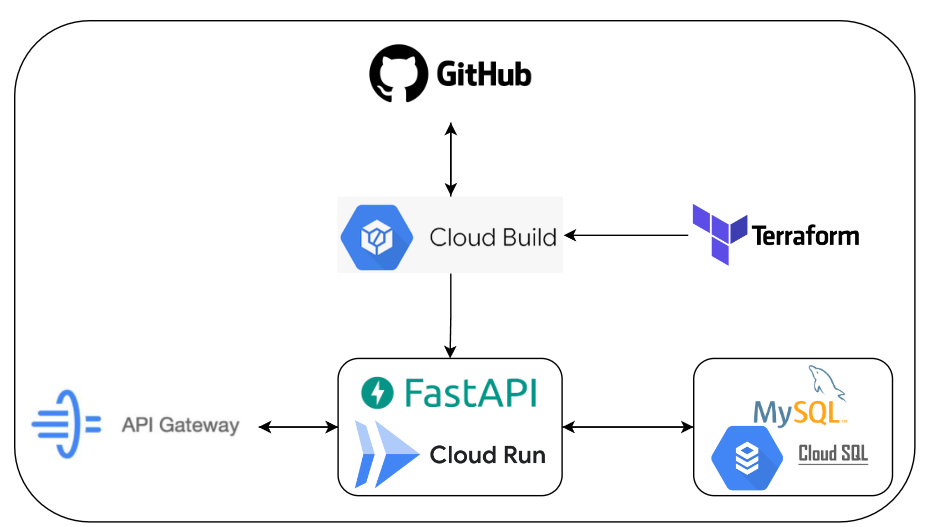

# Projeto de Engenharia de Dados: Disponibilização de dados através de uma API de um banco de dados SQL

## Introdução

Dentro do escopo de atividades de um engenheiro de dados, a disponibilização ou recebimento de dados por meio de uma API é uma prática comum. Essa API pode ser consumida por diferentes aplicações, alinhando-se com as vantagens associadas à filosofia de microsserviços. Dentre outras como melhoria da segurança, a abstração eficiente de dados, e a flexibilidade de manutenção. 

Nesse contexto, este projeto tem como objetivo o desenvolvimento de uma API capaz de realizar operações CRUD (Create, Read, Update, Delete) em um banco de dados MySQL hospedado no Cloud SQL, dentro do ambiente de nuvem da Google (GCP). Ao longo do desenvolvimento, serão incorporadas boas práticas de Integração Contínua e Entrega Contínua (CI/CD). Isso incluirá o provisionamento da infraestrutura como código, utilizando o Terraform, e a implementação de pipelines automatizadas de código. Essas práticas serão integradas ao GitHub, permitindo a execução automática em ambientes de produção ou desenvolvimento sempre que houver mudanças no repositório. 

## Tecnologias Utilizadas

- **MySql**: banco de dados relacional no qual está armazenado os dados de produção utilizado para o desenvolvimento da API.
- **CloudSql**: serviço gerenciado de banco de dados relacional na Cloud do Google utilizado para o Mysql. 
- **Cloud Run**: Ambiente serverless que hospedará um contêiner contendo Python, FastAPI e outros requisitos essenciais. Este ambiente é responsável pela execução do backend da API. 
- **FastApi**: Framework em Python utilizado para o desenvolvimento da API. Oferece desempenho eficiente e facilidade de desenvolvimento, possibilitando a criação de endpoints eficazes. 
- **Python**: Linguagem de programação utilizada no projeto, integrada ao framework FastAPI para a implementação da lógica da API. 
- **Secret Manager**: Serviço de armazenamento de senhas e outros dados sensíveis, utilizado para armazenar informações sobre as credencias do banco, garantindo maior segurança a API. 
- **Terraform**: Ferramenta que permite o provisionamento eficiente de toda a infraestrutura necessária, seguindo a metodologia de Infraestrutura como Código (IaC). Facilita a gestão e manutenção consistente da infraestrutura 
- **Docker**: Utilizado para criar imagens com as biliotecas necessárias que serão empregadas no CloudRun. 
- **Cloud Build**: Servico que possibilita implementar o deploy automatico de codigo e imagens de containers na nuvem, funcionando de forma integrado ao GitHub
- **GitHub**: Respositório responsável pelo versionamento do codigo, trabalhando de forma integrado ao 
- **Api Gateway**: servico que fornece uma camada de gerenciamento, proteção e monitoramento da API, podendo ser utilizado tambem para unificar difernetes servicos e diferentes rotas de aplicações diferentes.

 

 

## Arquitetura do Projeto

## Etapas do Projeto
### 1. Configuração do Ambiente

A fonte de dados para a API é um banco de dados relacional simulando dados de produção de um aplicativo de e-commerce. Utilizaremos o CloudSQL, um serviço gerenciado de banco de dados relacional no Google Cloud Platform (GCP), com MySQL como Sistema Gerenciador de Banco de Dados (SGBD). Os dados estão disponíveis em um dataset da Olist, um conhecido e-commerce brasileiro, hospedado no Kaggle (https://www.kaggle.com/datasets/olistbr/brazilian-ecommerce).
Dentro da pasta source do código-fonte, há um diretório chamado [data_ingestion](src/data_ingestion/) . Nele, encontra-se um [script Python](src/data_ingestion/data_ingestion.py) capaz de realizar a ingestão de dados da tabela de produtos no banco MySQL. As credenciais para interagir com o banco são armazenadas em um arquivo JSON no Secret Manager do GCP, sendo acessadas por meio de uma biblioteca que retorna essas credenciais para a conexão com o banco.

### 2. Desenvolvimento da Lógica da API

Com os dados já disponíveis no banco MySql é possível iniciar o desenvolvimento da lógica da API, para isso inicialmente será criada a classe [MySql](src/classes/mysql.py), no qual possibilitará interagir com o banco, realizando qualquer tipo de operação CRUD necessária. Junto disso também foi criada a classe [SecretManager](src/classes/secret_manager.py) , objeto que permite interagir o serviço de credencias do GCP, retornando as informações de autenticação necessárias para conexão com o banco. 

A API interage com a tabela de produtos, possuindo um endpoint chamado produtos, com quatro tipos de requisições diferentes seguindo o padrão REST API: GET (retorno de informações), PUT (alteração de dados), DELETE (exclusão) e POST (criação de registros). As requisições diferentes do GET necessitam de um objeto JSON no corpo da requisição, sendo validado por modelos definidos com a biblioteca Pydantic, no arquivo [base_models.py](src/classes/base_models.py). A lógica das requisições e endpoints é implementada usando o framework FastAPI, no arquivo [produtos.py](src/routes/produtos.py). 

A lógica de interação da API com o banco é realizada pela classe [IntegrateApiDataBase](src/classes/integrate_api_database.py) , que transforma as entradas fornecidas pela requisição em consultas SQL para operações CRUD no banco. Adicionalmente, foi incorporada uma lógica de paginação para eficiência e desempenho. Para garantir a segurança, implementou-se a autenticação por meio de token JWT, utilizando as classes [AuthBearer](src/classes/auth_bearer.py) e [JwtHandler](src/classes/jwt_handler.py). 

### 3. Criação da Imagem Docker

Para viabilizar o deployment da API, um [Dockerfile](Dockerfile) foi criado. Este arquivo continha uma imagem Python com todas as bibliotecas necessárias para o projeto além de conter todo o código fonte da aplicação. Após a criação do contêiner, uma instrução foi executada para criar um serviço utilizando o Uvicorn em uma porta específica, que seria utilizada para acessar a API. 

### 4. Criação do arquivo CloudBuild

A API será executada em um serviço Cloud Run a partir de uma imagem Docker, que contém Python, dependências necessárias e código-fonte da aplicação. O Cloud Run será acionado por meio de um Cloud Build, que é disparado a cada evento de modificação de código no Git. Criou-se um arquivo [cloudbuild.yaml](cloudbuild.yaml) que monta a imagem do Dockerfile, adiciona-a ao Artifact Registry e provisiona o Cloud Run a partir dessa imagem. Dessa forma, a cada modificação na lógica do código, o Cloud Build é acionado, atualizando a imagem do serviço e da aplicação. 

### 5. Provicionamento do Cloud Build

Com o arquivo pronto, é desenvolvido o gatilho do Cloud Build, que possibilita a implementação de boas práticas de CI/CD. Inicialmente é necessário criar um repositório no GitHub com o código, Dockerfile e arquivo (nome do arquivo). Após, é criado um Cloud Build no GCP que se conecta a esse repositório, funcionando como um gatilho que executa os comandos mencionados anteriormente sempre que houver alterações no código na branch main. O provisionamento desse serviço e a conexão com o repositório do Git são realizados pelos arquivos do Terraform na pasta [build](build/). 

### 6. Implementando Api Gateway

Com o Cloud Build configurado, a partir do primeiro commit na branch main do repositório, o serviço Cloud Run, que funciona como o backend da API, será provisionado. Agora, resta apenas configurar o API Gateway. Seu uso traz benefícios como gerenciamento de tráfego, roteamento, limitação de taxa de uso da API, logging e monitoramento centralizados. Além disso, funciona como uma solução de centralização de controle, unificando em uma única URL não apenas os endpoints da API desenvolvida, mas também de outras aplicações, mesmo em origens diferentes. O arquivo contendo o swagger do gateway pode ser encontrado no arquivo [user-api_olist.yaml](user-api_olist.yaml), que seria substituído pelo arquivo em produção.

#### Observação

Todo o código é documentado através de docstrings, o que possibilita um entendimento mais profundo do código em si caso necessário.

O provicionamento da CloudSql e Api gateway dentro de um cenário de produção já estariam sido implementandos, por isso não foram abordados ao longo do projeto.

## Pré-requisitos

Para executar o código deste projeto, é necessário possuir uma conta no Google Cloud Platform (GCP). Além disso, é necessárop ter o aplicativo Terraform e o CLI Cloud instalados localmente em sua máquina. 

## Executando o Projeto

1. Copie o diretório do projeto para uma pasta local em seu computador
2. Abra o terminal do seu computador e mova até o diretório do projeto.
3. Crie uma conta de serviço no GCP com as credenciais para todos os serviços mencionados, baixe uma chave em um arquivo json e coloque o arquivo no diretório raiz com nome creds.json.
4. Crie um arquivo json github_token.json, e crie uma chave github_token com o respectivo token da sua conta do github.
5. Vá ao arquivo variaveis do terraform e subsitua pelos seu respectivo valores
6. Crie um repositorio no git hub e suba todo o codigo pro projeto
7. Execute o comando: `terraform init`.
8. Execute o comando: `terraform plan`.
9. Execute o comando: `terraform apply`.

