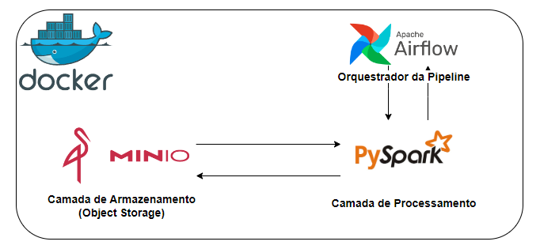

# Projeto de Engenharia de Dados: Solução de Versionamento de Dados (CDC) com PySpark

## Introdução

Este projeto foi concebido em resposta a uma necessidade identificada no meu ambiente de trabalho. Nossa equipe lida com uma tabela dentro de um Data Lake que sofre modificações (updates), o que impeça que seja possivel a existência de um histórico acessível. Curiosamente, a origem dessa tabela é um arquivo de backup de um banco de dados MySQL, o que impede de aplicar um processo de Change Data Capture (CDC) tradicional, o que nos levou a desenvolver um script capaz de simular um CDC.

Dada a escala dessa tabela, com mais de dois milhões de linhas e mais de vinte colunas, optamos pelo uso do PySpark, uma ferramenta ideal para o processamento de volumes massivos de dados. Como linguagem de programação, escolhemos o Python e utilizamos o PySpark como uma interface para interagir com o Apache Spark.

## Tecnologias Utilizadas

- **Python**: Utilizada como a linguagem de programação principal, junto com o framework PySpark, para desenvolver a pipeline capaz de simular o CDC e criar um histórico da tabela.
- **PySpark**: Framework de Big Data utilizado para processar os dados e gerar o histórico da tabela.
- **Minio Object Storage**: Uma camada de armazenamento que simula um Data Lake, proporcionando uma alternativa local ao Amazon S3. É utilizado como origem e destino das tabelas.
- **Apache Airflow**: Necessário para a execução diária do script e orquestração da pipeline.
- **Docker**: Utilizado para criar contêineres que hospedam o ambiente Python com PySpark, Minio e Apache Airflow.

## Arquitetura do Projeto

## Etapas do Projeto

### 1. Configuração do Ambiente

O início deste projeto envolve o desenvolvimento de uma infraestrutura para suportar o desenvolvimento e execução do código. Optamos por utilizar o Docker devido à sua facilidade de uso. Para o processamento dos dados, utilizamos o PySpark. Para isso, é necessário um contêiner que inclua o Python, PySpark, Java (pré-requisito do PySpark) e outras bibliotecas essenciais, como Minio, Pandas e NumPy. Para alcançar isso, criamos um [Dockerfile](/Dockerfile) que nos permite criar uma imagem personalizada com todas as bibliotecas necessárias. Além disso, configuramos um arquivo [docker-compose](/docker-compose.yml) para criar um contêiner Python com a imagem personalizada mencionada acima e outro contêiner para o Minio. É crucial configurar uma rede do tipo "bridge" no docker-compose para permitir a comunicação entre esses contêineres. Dentro da estrutura do projeto, criamos uma pasta chamada "airflow" para incluir o [docker-compose](/Airflow/docker-compose.yaml) responsável por criar o contêiner do Apache Airflow. 

Com a infra já configurada, estamos pronto para começar a codificar. Devido à natureza do projeto, estamos trabalhando com Programação Orientada a Objeto (POO), e as classes são organizadas na pasta [classe](/src/classes/) dentro do diretório [source](/src/). Todas as classes estão documentadas com o uso de docstrings para facilitar a compreensão da lógica do código.

### 2. Ingestão de Dados

Antes de começarmos a desenvolver o script PySpark para gerar o histórico das tabelas, é necessário configurar uma camada de armazenamento que simule a tabela. Utilizamos duas tabelas de exemplo: uma representa a tabela mais recente e a outra representa o histórico. Em seguida, criamos uma pipeline denominada  [ingestao_dados.py](/src/ingestao_dados.py/) que lê esses dois arquivos CSV e os salva no formato Parquet no bucket "gold" do Minio, simulando a camada "gold" de um Data Lake. Para simplificar a interação com o Minio, utilizamos as classes [ConectaMinio.py](/src/classes/conecta_minio.py) e [PysparkMinio.py](/src/classes/pyspark_minio.py). A primeira permite a criação de buckets, a listagem de arquivos e a inserção de arquivos na camada de armazenamento. A segunda,  [PysparkMinio.py](/src/classes/pyspark_minio.py), possibilita a leitura de arquivos do Data Lake e a escrita de arquivos nele através do PySpark.

### 3. Desenvolvimento da Lógica de Geração de Histórico

A próxima etapa do projeto envolve o desenvolvimento da lógica do script que compara duas tabelas e identifica as diferenças entre elas. O objetivo é criar uma tabela de histórico que mantém o registro das alterações ao longo do tempo, seguindo uma abordagem semelhante ao CDC (Change Data Capture). Para atingir esse objetivo, utilizamos a classe  [CapturaDadosAlterados.py](/src/classes/captura_dados_alterados.py). Esta classe compara duas tabelas, uma recente e uma de histórico, e executa as seguintes operações:

- Linhas novas são adicionadas à tabela de histórico.
- Linhas que não sofreram alterações permanecem inalteradas.
- Linhas que sofreram edições são marcadas como desativadas na tabela de histórico e as novas linhas são incluídas na tabela. A tabela de histórico resultante inclui uma coluna chamada "json_historico", que permite rastrear as alterações nas colunas das linhas desativadas. Isso fornece insights valiosos sobre as mudanças na tabela de produção.

Abaixo é possível visualizar o resultado final da tabela de historico, sendo possível visualizar a coluna de ativo, no qual mostras as linhas ativas, que sao que possuem o ultimo resultado e as desativadas, linhas que já foram deletadas logicamente. A coluna criado_em e editado_em informa a data de criação do registo e edição para quando o registro vier a ser desativado e por fim a coluna json_alteracoes, na qual é possível visualizar das linhas desativadas quais foram as mudanças e respectivas colunas.

### 4. Agendamento e Orquestração com Apache Airflow

Com o script de geração de histórico pronto, é importante agendar sua execução diariamente. Para isso, utilizamos o Apache Airflow para orquestrar a pipeline. Criamos uma DAG que é executada diariamente. Essa DAG utiliza o operador Docker para criar um contêiner com a imagem PySpark configurada inicialmente com as dependências necessárias, que executa o script principal responsável por gerar a tabela de histórico e escrevê-la no Data Lake. Com esta solução, podemos manter um registro detalhado das alterações na tabela de forma eficiente e escalável, permitindo uma análise abrangente das mudanças ao longo do tempo.

#### Observação

O projeto concentra-se no desenvolvimento da lógica da tabela CDC, e não necessariamente na segurança. Para simplificar o código, não serão criadas variáveis de ambiente para as credenciais, que, em vez disso, serão diretamente incorporadas no código.

## Pré-requisitos

Antes de prosseguir com este projeto, é necessário ter o Docker Desktop instalado em sua máquina local.

## Executando o Projeto

Siga os passos abaixo para rodar este projeto:

1. Copie o diretório do projeto para uma pasta local em seu computador.

2. Abra o terminal do seu computador e mova até o diretório do projeto.

3. Entra na pasta src/jars e baixa o conector do pypsark no seguinte link https://repo1.maven.org/maven2/com/amazonaws/aws-java-sdk-bundle/1.11.1026/aws-java-sdk-bundle-1.11.1026.jar e salve nesta mesma pasta, retorne a pasta do projeto raiz novamente pelo terminal.

4. Crie a imagem do container do PySpark executando o seguinte comando: `docker build -t pyspark_image .`

5. Crie os containers do PySpark e MinIO usando o seguinte comando: `docker-compose up -d`

6. Navegue até a pasta do Airflow no terminal, aguarde a execução do container do PySpark e, em seguida, crie o container do Airflow com o seguinte comando: `docker-compose up -d`

## Conclusão 

Ao longo do projeto, destacamos a utilização de tecnologias-chave, como o Python e o PySpark, para desenvolver uma pipeline capaz de simular o CDC e criar um histórico acessível da tabela. Além disso, integramos o Minio Object Storage e o Apache Airflow para suportar a ingestão de dados e a orquestração da pipeline.

O desenvolvimento da lógica de geração de histórico permitiu-nos identificar e registrar as alterações na tabela, aplicando uma abordagem semelhante ao CDC tradicional. Isso nos proporcionou um registro histórico valioso das mudanças na tabela ao longo do tempo, contribuindo para uma análise detalhada e rastreabilidade dos dados. A orquestração do projeto por meio do Apache Airflow permitiu agendar a execução diária da solução, garantindo que o histórico da tabela seja mantido de forma consistente e atualizada.

Embora o foco principal do projeto estivesse na lógica do CDC e na eficiência da solução, é importante observar que, por motivos de simplicidade, não foram criadas variáveis de ambiente para as credenciais, e estas foram diretamente incorporadas no código. Isso deve ser considerado ao implementar a solução em um ambiente de produção.

Em resumo, este projeto de Engenharia de Dados proporcionou uma solução eficaz para a necessidade de versionamento de dados em uma tabela em constante modificação, demonstrando a aplicação bem-sucedida de tecnologias e conceitos de Big Data para resolver desafios reais.

